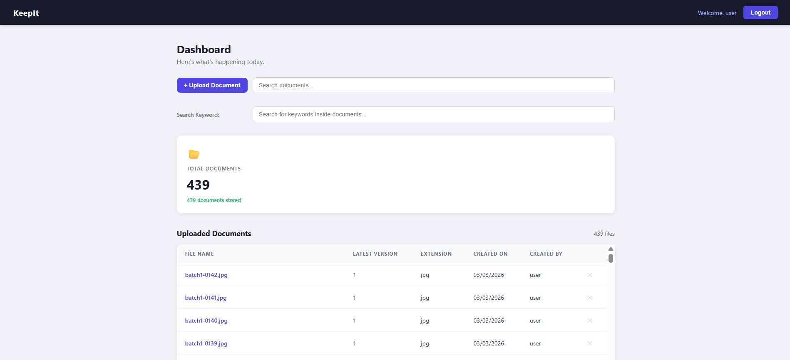
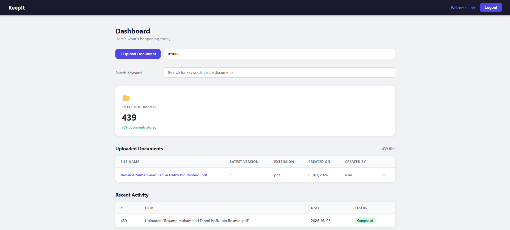
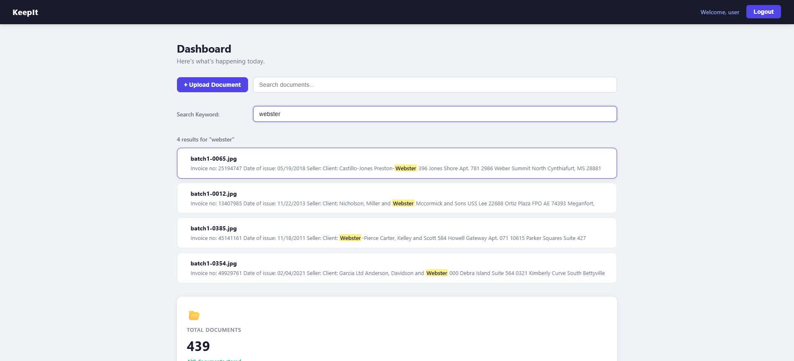
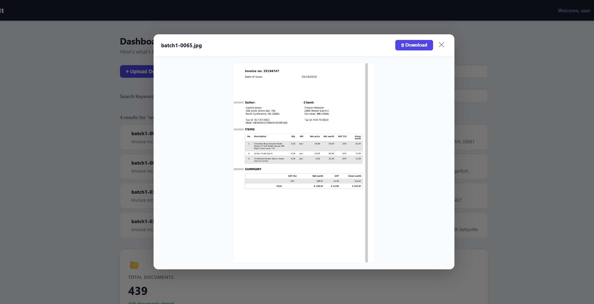

# KeepIt






A web-based document management system that lets you upload, search, view, and manage files — with full-text content search powered by Elasticsearch and OCR support for scanned documents.

---

## Features

- **Upload documents** — supports PDF, images, Word, Excel, PowerPoint, text files, and archives
- **View documents inline** — preview PDFs, images, and text files directly in the browser
- **Download & delete** documents
- **Search by filename** — filter documents in real time
- **Search by keyword** — full-text search inside document content via Elasticsearch
- **OCR support** — extracts text from scanned/image-only PDFs using Tesseract.js
- **Activity log** — tracks all upload, view, and delete actions
- **Login authentication** — session-based access control

---

## Tech Stack

| Layer      | Technology                              |
|------------|-----------------------------------------|
| Backend    | Node.js, Express                        |
| Database   | MySQL (metadata + binary file storage)  |
| Search     | Elasticsearch (full-text content index) |
| OCR        | Tesseract.js + pdfjs-dist + canvas      |
| Parsing    | pdf-parse, Mammoth (DOCX)               |
| Frontend   | Vanilla HTML, CSS, JavaScript           |

---

## Prerequisites

Make sure the following are installed and running before starting:

- [Node.js](https://nodejs.org/) v18+
- [MySQL](https://www.mysql.com/) 8+
- [Elasticsearch](https://www.elastic.co/) 8+

---

## Getting Started

### 1. Clone the repository

```bash
git clone https://github.com/famipiji/KeepIt.git
cd KeepIt
```

### 2. Install dependencies

```bash
npm install
```

### 3. Set up the database

Run the following SQL in MySQL Workbench or terminal:

```sql
CREATE DATABASE IF NOT EXISTS keepit CHARACTER SET utf8mb4 COLLATE utf8mb4_unicode_ci;
USE keepit;

CREATE TABLE IF NOT EXISTS documents (
    id          INT          NOT NULL AUTO_INCREMENT,
    name        VARCHAR(255) NOT NULL,
    size        BIGINT       NOT NULL,
    type        VARCHAR(100),
    data        LONGBLOB     NOT NULL,
    uploaded_at DATETIME     NOT NULL DEFAULT CURRENT_TIMESTAMP,
    PRIMARY KEY (id)
) ENGINE=InnoDB DEFAULT CHARSET=utf8mb4 COLLATE=utf8mb4_unicode_ci;

CREATE TABLE IF NOT EXISTS activity (
    id         INT                                  NOT NULL AUTO_INCREMENT,
    item       VARCHAR(255)                         NOT NULL,
    status     ENUM('Completed','Pending','Failed') NOT NULL,
    created_at DATETIME                             NOT NULL DEFAULT CURRENT_TIMESTAMP,
    PRIMARY KEY (id)
) ENGINE=InnoDB DEFAULT CHARSET=utf8mb4 COLLATE=utf8mb4_unicode_ci;
```

> The server also auto-creates these tables on startup if they don't exist.

### 4. Configure environment variables

Create a `.env` file in the project root:

```env
DB_HOST=localhost
DB_USER=root
DB_PASSWORD=your_password_here
DB_NAME=keepit

ES_NODE=http://localhost:9200
```

### 5. Start Elasticsearch

If using Docker:

```bash
docker run -d --name elasticsearch -p 9200:9200 \
  -e "discovery.type=single-node" \
  -e "xpack.security.enabled=false" \
  elasticsearch:8.13.0
```

### 6. Start the server

```bash
npm start
```

### 7. Open the app

Go to [http://localhost:3000](http://localhost:3000) in your browser.

---

## Project Structure

```
KeepIt/
├── server.js        # Express backend — API routes, DB, Elasticsearch
├── dashboard.html   # Main dashboard UI
├── login.html       # Login page
├── package.json
├── .env             # Environment variables (not committed)
└── extracts/        # Temporary extracted text cache (auto-created)
```

---

## API Endpoints

| Method   | Endpoint                      | Description                     |
|----------|-------------------------------|---------------------------------|
| `POST`   | `/api/upload`                 | Upload a file                   |
| `GET`    | `/api/documents`              | List all documents (metadata)   |
| `GET`    | `/api/documents/:id`          | Download a file                 |
| `GET`    | `/api/documents/:id/view`     | View file inline                |
| `GET`    | `/api/documents/:id/extract`  | Get extracted text content      |
| `DELETE` | `/api/documents/:id`          | Delete a file                   |
| `GET`    | `/api/search/content`         | Full-text keyword search        |
| `GET`    | `/api/activity`               | Get activity log                |
| `POST`   | `/api/activity`               | Add activity entry              |
| `DELETE` | `/api/activity/:id`           | Remove activity entry           |

---

## Supported File Types

| Category   | Extensions                                      |
|------------|-------------------------------------------------|
| PDF        | `.pdf`                                          |
| Images     | `.jpg`, `.jpeg`, `.png`, `.gif`, `.bmp`, `.webp`|
| Documents  | `.doc`, `.docx`, `.xls`, `.xlsx`, `.ppt`, `.pptx`|
| Text       | `.txt`, `.csv`, `.md`                           |
| Archives   | `.zip`, `.rar`                                  |
